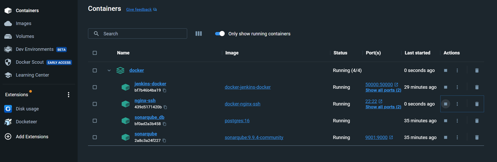

# DeyAppsWeb
DeyApps is a content website. It shows a brief description of the programmer, hobbies, achievements and published projects.

* [DeyAppsWeb](https://deyapps-a0de1.web.app/home)

## Technologies
Project is created with:
* Visual Code
* HTML5, SCSS3 y Typescript
* Angular 13
* Primeng 13
* Jasmine and Karma

## Environment on Docker

## Continuous Integration & Continuous Delivery

## Quality with SonarQube

